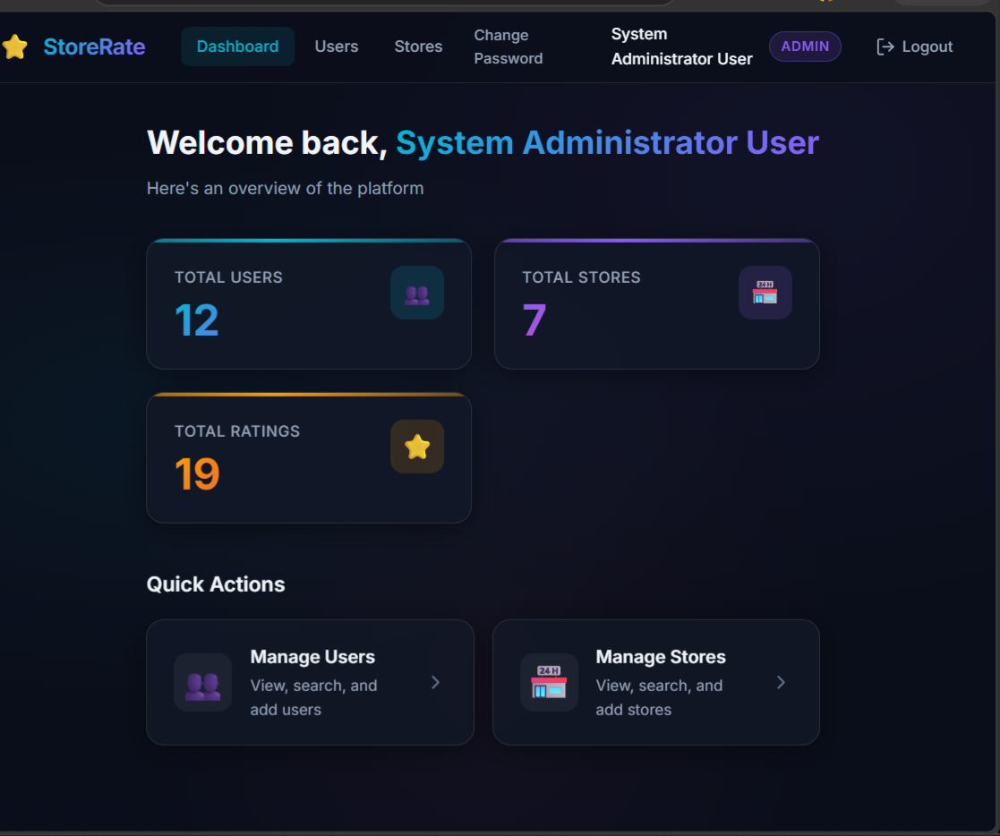
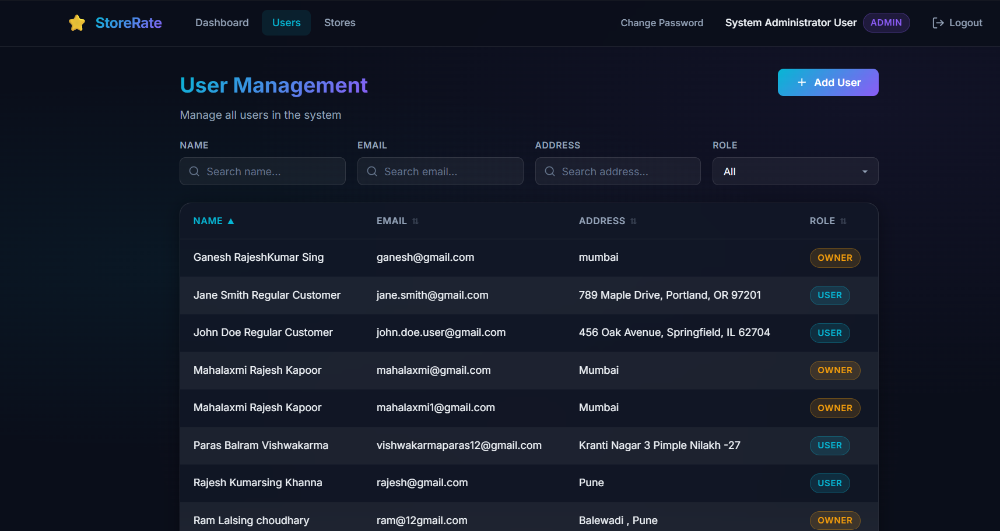
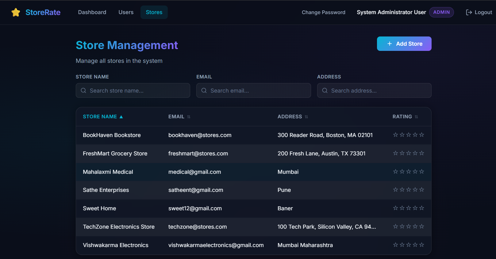
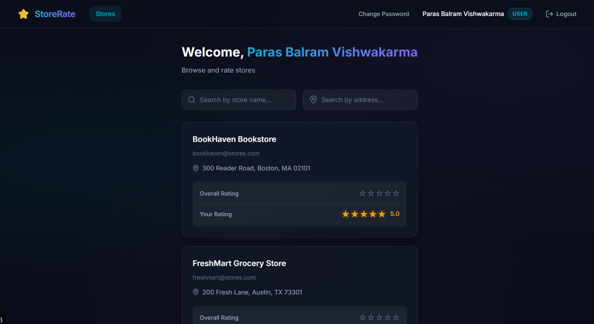

# Store Rating & Management System

A full-stack web application that allows users to submit ratings for stores registered on the platform. The platform supports role-based access control with dedicated functionalities for System Administrators, Normal Users, and Store Owners.

---

# Technologies Used

### Frontend

* React.js
* Vite
* React Router DOM
* Axios
* CSS (Custom Dark Glassmorphism UI)

### Backend

* Node.js
* Express.js
* JWT Authentication
* Express Validator

### Database

* MySQL
* mysql2 (Promise-based queries)

---

# Features

## System Administrator

* Login to the platform
* Dashboard displaying:

  * Total Users
  * Total Stores
  * Total Ratings
* Add new Users
* Add new Admin Users
* Add new Store Owners
* Add new Stores
* View all Users
* View all Stores
* Search and filter Users
* Search and filter Stores
* Sort Users and Stores
* View User Details
* View Store Owner Ratings
* Logout

---

## Normal User

* Register Account
* Login
* Change Password
* Browse Stores
* Search Stores by Name
* Search Stores by Address
* View Overall Store Ratings
* Submit Ratings (1–5)
* Update Previously Submitted Ratings
* Logout

---

## Store Owner

* Login
* Change Password
* View Store Dashboard
* View Average Rating of Store
* View Users who submitted ratings
* View Ratings Submitted by Users
* Logout

---

# Authentication & Authorization

The application uses JWT (JSON Web Token) Authentication.

### Roles

* Admin
* User
* Store Owner

Protected routes are secured using:

* Authentication Middleware
* Role-Based Authorization Middleware

---

# Form Validation Rules

### Name

* Minimum 20 Characters
* Maximum 60 Characters

### Address

* Maximum 400 Characters

### Password

* Minimum 8 Characters
* Maximum 16 Characters
* Must contain at least one Uppercase Letter
* Must contain at least one Special Character

### Email

* Standard Email Format Validation

### Rating

* Integer value between 1 and 5

---

# Database Schema

## Users Table

| Field    | Type    |
| -------- | ------- |
| id       | INT     |
| name     | VARCHAR |
| email    | VARCHAR |
| password | VARCHAR |
| address  | TEXT    |
| role     | ENUM    |

---

## Stores Table

| Field    | Type    |
| -------- | ------- |
| id       | INT     |
| name     | VARCHAR |
| email    | VARCHAR |
| address  | TEXT    |
| owner_id | INT     |

---

## Ratings Table

| Field    | Type |
| -------- | ---- |
| id       | INT  |
| user_id  | INT  |
| store_id | INT  |
| rating   | INT  |

---

# Project Structure

```text
store-rating-management-system/

├── frontend/
│   ├── src/
│   │   ├── api/
│   │   ├── components/
│   │   ├── context/
│   │   ├── pages/
│   │   └── styles/
│   │
│   └── package.json
│
├── backend/
│   ├── config/
│   ├── controllers/
│   ├── middleware/
│   ├── routes/
│   ├── services/
│   ├── utils/
│   ├── seed/
│   └── package.json
│
└── README.md
```

---

# Setup Instructions

## Prerequisites

* Node.js (v18+)
* MySQL Server

---

## Database Configuration

Default Database Configuration:

```env
DB_HOST=localhost
DB_PORT=3306
DB_USER=root
DB_PASSWORD=
DB_NAME=store_rating_db
```

Update the `.env` file if your configuration differs.

---

## Backend Setup

```bash
cd backend

npm install

npm run seed

npm run dev
```

Backend runs on:

```text
http://localhost:5000
```

---

## Frontend Setup

```bash
cd frontend

npm install

npm run dev
```

Frontend runs on:

```text
http://localhost:5173
```

---

# Major API Endpoints

## Authentication

```http
POST /api/auth/register
POST /api/auth/login
PUT  /api/auth/change-password
```

---

## Admin

```http
GET  /api/admin/dashboard

GET  /api/admin/users
POST /api/admin/users

GET  /api/admin/stores
POST /api/admin/stores
```

---

## User

```http
GET  /api/stores

POST /api/ratings
PUT  /api/ratings/:id
```

---

## Store Owner

```http
GET /api/owner/dashboard
```

---

# Sample Test Accounts

## Admin

```text
Email: admin@storerating.com
Password: Admin@1234
```

## User

```text
Email: john.doe.user@gmail.com
Password: User@12345
```

## Store Owner

```text
Email: owner.store@gmail.com
Password: Owner@1234
```

---

# Future Enhancements

* Email Verification
* Forgot Password Feature
* Profile Management
* Store Image Uploads
* Analytics Dashboard
* Docker Support
* CI/CD Pipeline

---

# Screenshots

## Admin Dashboard



## User Management



## Store Management



## User Dashboard



## Store Owner Dashboard


---

# Author

Paras Vishwakarma

Full Stack Developer | React.js | Node.js | Express.js | MySQL
